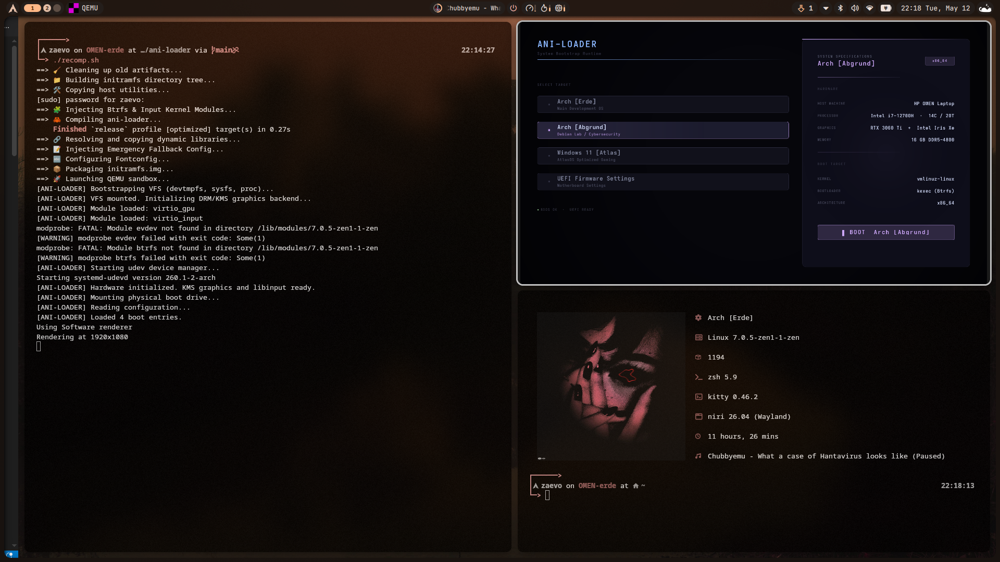

# Ani-Loader


A high-fidelity bootloader runtime built with Rust and Slint. It's currently designed specifically for my HP OMEN 16 (i7-14650HX / RTX 4060) to provide a seamless, aesthetically pleasing transition from firmware to the kernel via kexec.

I started working on this because the standard GRUB themes were too static, and rEFInd was giving me issues with btrfs.

## Features
- Slint-Powered UI: A modern, hardware-accelerated interface featuring Catppuccin color palettes (scriptable, can be riced).

- Btrfs-Native: Built-in logic to parse and mount Btrfs subvolumes (@arch, @sec, etc.) directly from the loader, will later implement other filesystems too.

- Kexec Handoff: Performs a warm reboot into the target kernel, bypassing the slow "cold boot" hardware initialization.

## Tech Stack

- Language: Rust (System-level safety & performance)

- Graphics: Slint (Declarative UI with specialized graphics backend)

- Handoff: Linux kexec

- Target Architecture: x86_64 (Optimized for Raptor Lake Refresh)

## Repository Structure
```
.
├── src/                # Rust logic (Mounting, parsing, kexec execution)
├── ui/                 # Slint markup for the high-fidelity UI
├── kernel/             # Custom kernel I'm working on (Source ignored via .gitignore)
├── recomp.sh           # The master build script (Staging, compilation, QEMU testing)
├── launch_gui.sh       # Loads the qemu instance only (Assumes recomp.sh has been run before)
├── Cargo.toml          # Rust dependencies (Slint, Serde, TOML)
└── ani-loader.toml     # The boot configuration blueprint
```

## Quick Start

To build the initramfs.img and test it within the QEMU sandbox:

``` Bash
chmod +x recomp.sh
./recomp.sh
```

The script handles the Rust compilation, library resolution, staging the initramfs directory tree, and launching the QEMU environment with a mock Btrfs drive. Currently has all 4 of my own boot entries

## Configuration

ani-loader looks for a configuration file at /@arch/boot/ani-loader.toml on your physical partition.

Eg. 
```Ini, TOML
[[entries]]
name = "Arch [OMEN-Erde]"
os_type = "linux"
subvol = "@arch"
kernel = "/boot/vmlinuz-omen-custom"
initrd = ["/boot/intel-ucode.img"]
cmdline = "root=UUID=your-uuid-here rw rootflags=subvol=@arch quiet splash"
```

## Current Progress
- GUI phase:
    - [x] Slint UI Handoff
- Backend phase:
    - [x] Btrfs Subvolume Mounting
    - [x] Kexec Logic Fix (Multi-initrd support)
- QEMU phase:
    - [x] Setting up launch script with mock mount setup.
- Kernel setup:
    - [ ] Compiling my own kernel
    - [ ] Driver Integrations
    - [ ] Physical hardware deployment (UEFI entry creation)

## Info you might appreciate

All the work I did, was inside a mock partition that was btrfs partitioned by me to mimic my actual `linux pool` partition, so before you try to launch the GUI yourself using qemu, do these things on your setup too:

```bash
# Created a 2GB sparse file
truncate -s 2G mock_disk.raw

# Created a single GPT partition
echo "label: gpt" | sfdisk mock_disk.raw
echo "type=0FC63DA1-2637-4062-A410-1559BA770C9A" | sfdisk mock_disk.raw

# Attached the image to a loop device
sudo losetup -Pf mock_disk.raw

# Formatted the first partition as Btrfs (First assumes /dev/loop0, then checks for 'lsblk' if unsure)
sudo mkfs.btrfs -L "ANI_MOCK" /dev/loop0p1

# Mounted the partition root
sudo mkdir -p /mnt/mockmount
sudo mount /dev/loop0p1 /mnt/mockmount

# Created the Erde and Abgrund subvolumes
sudo btrfs subvolume create /mnt/mockmount/@arch
sudo btrfs subvolume create /mnt/mockmount/@sec

# Created the boot directories
sudo mkdir -p /mnt/mockmount/@arch/boot /mnt/mockmount/@sec/boot

# Copied my boot files to @arch
sudo cp /boot/vmlinuz-linux-zen /mnt/mockmount/@arch/boot/
sudo cp /boot/initramfs-linux-zen.img /mnt/mockmount/@arch/boot/
sudo cp /boot/intel-ucode.img /mnt/mockmount/@arch/boot/

# Did the same for @sec
sudo cp /boot/vmlinuz-linux /mnt/mockmount/@sec/boot/vmlinuz-linux
sudo cp /boot/initramfs-linux.img /mnt/mockmount/@sec/boot/initramfs-linux.img

# Drop the TOML into the @arch subvolume (Didn't include Windows and UEFI entries because work remains.)
sudo tee /mnt/mockmount/@arch/boot/ani-loader.toml << 'EOF'
[[entries]]
name = "Arch [Erde]"
os_type = "linux"
subvol = "@arch"
kernel = "/boot/vmlinuz-linux-zen"
initrd = ["/boot/intel-ucode.img", "/boot/initramfs-linux-zen.img"]
cmdline = "root=/dev/vda1 rw rootflags=subvol=@arch quiet splash"

[[entries]]
name = "Arch [Abgrund]"
os_type = "linux"
subvol = "@sec"
kernel = "/boot/vmlinuz-linux"
initrd = ["/boot/intel-ucode.img", "/boot/initramfs-linux.img"]
cmdline = "root=/dev/vda1 rw rootflags=subvol=@sec quiet splash"
EOF

# Sync and detach
sudo umount /mnt/mockmount
sudo losetup -d /dev/loop0
```

## Prerequisites

Ensure you have the necessary build tools and virtualization packages installed (Arch Linux example): 

```bash 
sudo pacman -S --needed base-devel rustup qemu-full btrfs-progs sfdisk cpio 
rustup default stable
``` 